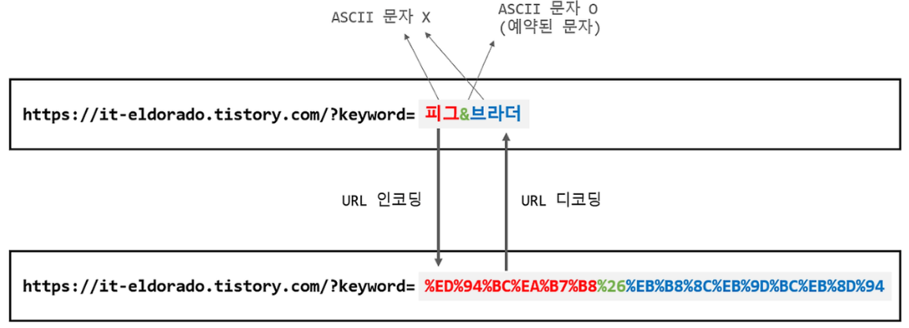

# 05_URL 인코딩

> URL 인코딩은 왜 필요할까?

## 1. URL 인코딩이란?

### 1) 정의

URL로 사용할 수 없는 문자열을 URL에 사용할 수 있도록 변환(암호화)하여 사용하는 것을 말한다.

서버가 이해할 수 있는 표준 형식으로 URL을 변환하는 것을 의미하는 것이다.

### 2) 필요성?

URL 인코딩이 필요한 이유는 URL은 `ASCII` 문자 집합으로 구성되어야 하기 때문이다. 따라서 영어를 제외하고는 인코딩 없이 바로 URL로 사용할 수 없다.

※ 참고로 URL에 한글이 표시되는 경우도 볼 수 있는데, 이는 실제 한글이 아니라 단순히 브라우저가 한글로 표현을 한 것일 뿐 실제로는 인코딩된 URL로 소통하는 것이다.

### 3) UTF-8 인코딩

ASCII 방식은 한국어, 중국어 등의 언어에 대해 대응을 하지 못하기 때문에 국제 표준인 UTF-8형식으로 바꿔서 이에 대응하는 유니코드 알파벳을 가지고 URL을 인코딩하는 것이다.

이를 보다 정확히 표현하자면 URL 인코딩의 형식이 UTF-8이라는 의미이다.

그런데 여기서 중요한 것은 url을 전부 UTF-8 형식으로 인코딩하면 안 된다. 인코딩이 필요한 부분에 대해서만 UTF-8로 인코딩하는 것이 중요하다.

예를 들어 `https://`를 단순 UTF-8 인코딩을 하게 되면 `https%3A%2F%2F`가 된다.

왜냐하면 URL에 포함되는 `?, /, &, !, #` 등 특정 기호들의 경우, 이미 예약된 의미를 가지고 있는 문자인데 UTF-8에 해당하는 유니코드가 존재하기 때문에 단순 치환하면 그 의미가 없어지게 된다.

따라서 UTF-8 형식으로 URL 인코딩할 때에는 인코딩이 필요한 문자열에 한해서만 UTF-8형태로 인코딩한다고 이해하면 된다.

 

## 2. java.net.URLEncoder

java.net.URLEncoder를 사용하면 공백을 제외하고는 거의 대부분의 특수문자에 대해 정확히 URL 인코딩을 해준다.

단, 공백(" ")만 `+`로 인코딩을 해주기 때문에 공백의 인코딩 값인 `%20`으로 올바로 변환하기 위해서는 URLEncoder를 사용하여 변환한 값에서 +에 대해서만 %20으로 변환(replace)해주면 된다.

다시 한 번 말하지만 모든 문자열에 대해서 URL 인코딩을 하면 안 되고, URL인코딩이 필요한 문자셋 즉, ASCII에 대응되지 않는 문자셋에 대해만 URL 인코딩을 해줘야 한다.

