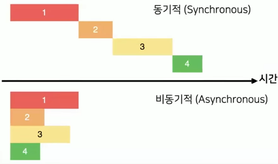
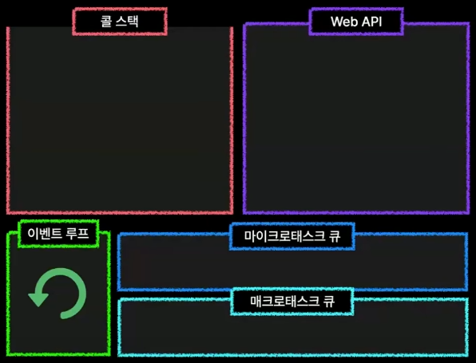

# 06_자바스크립트 비동기 동작 원리

> 자바스크립트는 어떻게 동시에 작업을 처리할 수 있을까?

## 1. 싱글 스레드

자바스크립트는 한 번에 하나의 작업만 가능한 싱글 스레드로 동작한다.

그런데 실제 웹 사이트 브라우저를 보면 한 페이지 내에서 여러 작업들이 동시에 발생되어 처리되는 것처럼 보인다.

어떻게 동시에 여러 일을 처리할 수 있는 것처럼 보일까?

정답은 비동기에 있다.

 

## 2. 동기와 비동기

동기적으로 일을 처리한다는 것은 모든 작업이 순서에 맞게 각 작업이 끝나면 다음 작업을 처리하는 형태로 일을 처리한다는 것이다.

반면에 비동기로 일을 처리한다는 것은 한 작업이 끝날 때까지 대기하지 않고 다른 작업도 처리하는 것을 말한다.

 

## 3. 자바스크립트의 런타임 환경 구조

자바스크립트의 런타임 환경은 다음과 같이 콜 스택(자바스크립트 엔진), Web API, 태스크큐(마이크로, 매크로), 이벤트 루프로 구성되어 있다.

자바스크립트는 싱글 스레드이기 때문에 콜 스택에서 함수(실행 컨텍스트)를 처리하다가 비동기적 코드를 만나면 이를 별도의 공간에서 처리한다.

- 콜 스택에 쌓인 작업을 LIFO(Last In First Out)으로 처리하다가 비동기적 코드를 만나면 Web API를 호출하여 처리를 요청하고 Web API는 처리가 끝난 콜백 함수를 태스크 큐로 전달한 다음, 이벤트 루프가 태스크 큐에 있는 콜백 함수를 다시 콜스택에 전달하는 형태로 동작한다.

### 1) 콜스택

자바스크립트 엔진 내부에 존재하는 스택 형태의 함수(실행 컨텍스트) 처리 엔진.

함수가 호출된 순서대로 먼저 쌓이고, 가장 최근에 콜 스택에 들어온 함수부터 처리한다.

스택이 하나(싱글 스레드)이기 때문에 다른 일을 동시에 할 수 없는 구조이다.

### 2) Web API

자바스크립트가 실행되는 런타임 환경에 존재하는 별도의 api. 브라우저의 web api라고도 한다.

DOM, Timer(setTimeOut), Network(fetch), 이벤트 핸들러 등의 api가 존재한다.

자바스크립트와 다르게 멀티 스레드로 동작하며, 비동기적으로 일을 처리할 수 있어 자바스크립트의 싱글 스레드가 멈추는 것을 방지하는 역할을 한다.

### 3) 태스크 큐

web api에서 작업이 완료된 함수들은 콜백 형태(콜백 함수)로 태스크 큐로 전달되어 대기한다.

태스크 큐는 마이크로태스크 큐와 매크로태스크 큐로 나뉘며 마이크로태스크 큐에는 우선순위가 높은 작업을, 매크로태스크 큐에는 우선순위가 낮은 일반적인 비동기 콜백 함수를 저장한다.

- 마이크로태스크 큐:  promise의 then, catch, finally 등의 비동기 작업
- 매크로태스크 큐: setTimeOut, setInterval, fetch 등의 비동기 작업

콜 스택과 달리 먼저 들어온 콜백 함수가 먼저 빠져나가는 FIFO(First In First Out) 형태로 동작한다.

### 4) 이벤트 루프

콜스택과 태스크 큐를 모니터링하여, 콜스택이 비어있고 태스크 큐에 대기 중인 콜백 함수가 있다면 이를 자바스크립트 엔진에게 알려서 콜백 함수를 콜스택으로 옮겨서 일을 처리할 수 있게 하는 역할을 한다.

이러한 런타임 환경 덕분에 자바스크립트는 싱글스레드임에도 불구하고 동시에 일을 처리할 수 있게 되었다.

